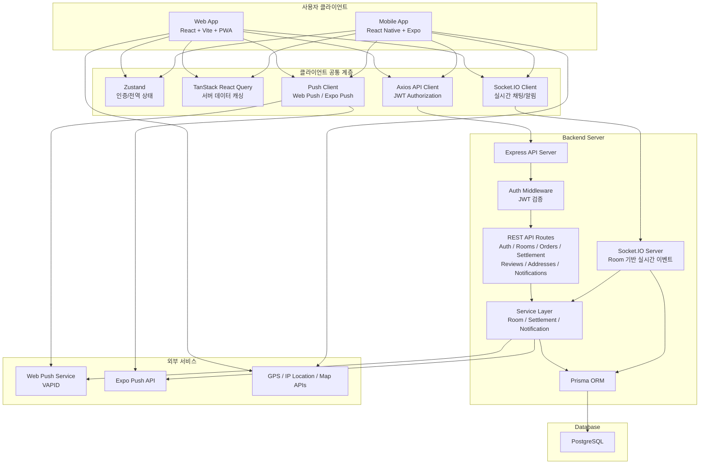

##  시스템 아키텍처

```mermaid
flowchart TB
    subgraph Client["사용자 클라이언트"]
        Web["Web App\nReact + Vite + PWA"]
        Mobile["Mobile App\nReact Native + Expo"]
    end

    subgraph FrontState["클라이언트 공통 계층"]
        Zustand["Zustand\n인증/전역 상태"]
        Query["TanStack React Query\n서버 데이터 캐싱"]
        Axios["Axios API Client\nJWT Authorization"]
        SocketClient["Socket.IO Client\n실시간 채팅/알림"]
        PushClient["Push Client\nWeb Push / Expo Push"]
    end

    subgraph Server["Backend Server"]
        Express["Express API Server"]
        Auth["Auth Middleware\nJWT 검증"]
        Routes["REST API Routes\nAuth / Rooms / Orders / Settlement\nReviews / Addresses / Notifications"]
        SocketServer["Socket.IO Server\nRoom 기반 실시간 이벤트"]
        Services["Service Layer\nRoom / Settlement / Notification"]
        Prisma["Prisma ORM"]
    end

    subgraph DB["Database"]
        Postgres["PostgreSQL"]
    end

    subgraph External["외부 서비스"]
        WebPush["Web Push Service\nVAPID"]
        ExpoPush["Expo Push API"]
        Geo["GPS / IP Location / Map APIs"]
    end

    Web --> Zustand
    Web --> Query
    Web --> Axios
    Web --> SocketClient
    Web --> PushClient

    Mobile --> Zustand
    Mobile --> Query
    Mobile --> Axios
    Mobile --> SocketClient
    Mobile --> PushClient

    Axios --> Express
    Express --> Auth
    Auth --> Routes
    Routes --> Services
    Services --> Prisma
    Prisma --> Postgres

    SocketClient --> SocketServer
    SocketServer --> Prisma
    SocketServer --> Services

    Services --> WebPush
    Services --> ExpoPush
    PushClient --> WebPush
    PushClient --> ExpoPush

    Web --> Geo
    Mobile --> Geo
```
