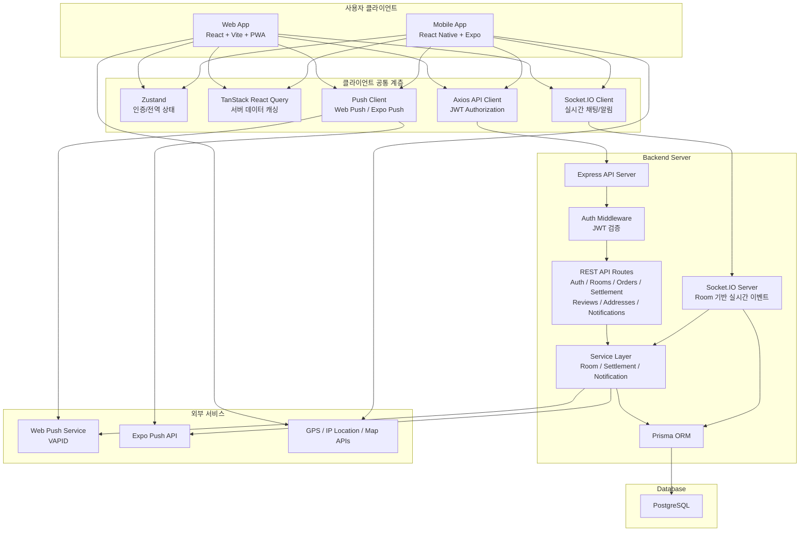

## 기술 스택

| 영역 | 사용 기술 | 설명 |
| --- | --- | --- |
| Web Frontend | React 18, TypeScript, Vite | 웹 클라이언트 UI 구현 및 빠른 개발 환경 구성 |
| Mobile App | React Native, Expo, TypeScript | iOS/Android 모바일 앱 개발 |
| Styling | Tailwind CSS, NativeWind | 웹/모바일 공통 스타일링 체계 구성 |
| Routing / Navigation | React Router, React Navigation | 웹 페이지 라우팅 및 모바일 화면 전환 관리 |
| State Management | Zustand | 로그인 정보 및 전역 상태 관리 |
| Server State | TanStack React Query | API 데이터 캐싱, 동기화, 비동기 상태 관리 |
| API Client | Axios | REST API 요청 및 JWT 토큰 인터셉터 처리 |
| Realtime | Socket.IO | 채팅, 방 상태, 알림 등 실시간 이벤트 처리 |
| Backend | Node.js, Express, TypeScript | REST API 서버 및 비즈니스 로직 구현 |
| Authentication | JWT, bcryptjs | 사용자 인증, 비밀번호 암호화, 보호 라우트 처리 |
| Database | PostgreSQL | 사용자, 주문방, 주문, 정산, 알림 데이터 저장 |
| ORM | Prisma | 데이터 모델링 및 타입 안전한 DB 접근 |
| Notification | Web Push, VAPID, Expo Push Notifications | 웹 PWA 및 모바일 푸시 알림 구현 |
| Location / Map | Geolocation API, react-native-maps, react-native-nmap | 위치 기반 주문방 탐색 및 픽업 위치 표시 |
| DevOps / Deploy | Docker Compose, Vercel, EAS | DB 로컬 환경 구성, 웹/모바일 배포 설정 |

##  시스템 아키텍처

